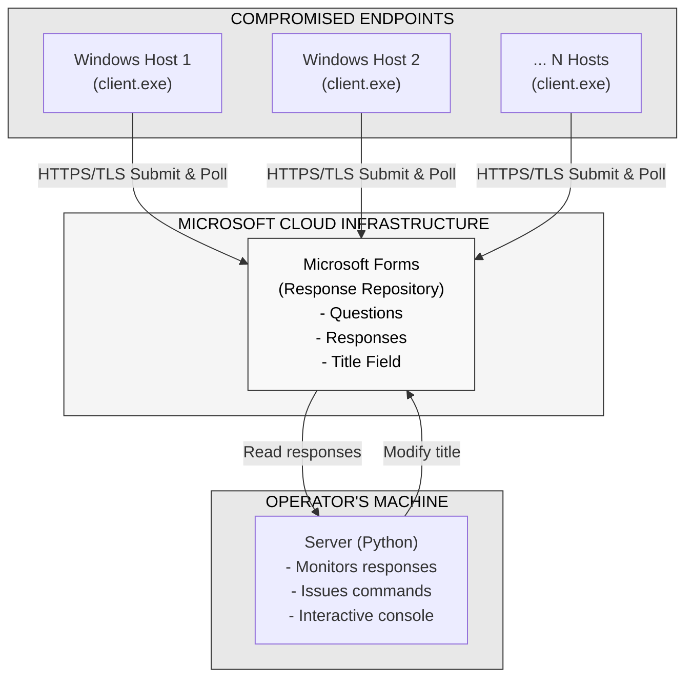

# CacherC2

## Introduction

CacherC2 demonstrates a novel approach to Command and Control (C2) infrastructure by leveraging Microsoft Forms as the primary communication medium. Unlike traditional C2 frameworks which require dedicated servers, complex infrastructure, and custom protocols, this solution uses a legitimate Microsoft cloud service to establish bidirectional communication with compromised endpoints, reducing the attacker's footprint and blending traffic with ordinary enterprise activity.


---

## Setup

### 1. Creating the Microsoft Form

Before deploying the C2 framework, you must create a Microsoft Form with the exact specifications below. This form acts as the centralized communication hub between the operator and all active agents.

#### Configuration Requirements

| Setting | Value |
|---|---|
| **Access level** | Public — anyone with the link can access |
| **Title field** | Exactly one title field (used to issue commands to clients) |
| **Questions** | Exactly **9** questions, all of type **Text** (single-line), named `A` through `I` |

> The form must be public so that both agents and the server can submit and retrieve data without authentication complications.


---

### 2. Configuring the Agent

**Step 1 — Get the Form ID**

After publishing the form, extract its ID from the response URL:

```
https://forms.cloud.microsoft/Pages/ResponsePage.aspx?id=[FORM_ID_HERE]
```

**Step 2 — Paste the ID into the agent source**

Edit `cmd/client/main.go` at line 14 and replace the placeholder with your Form ID:

```go
const (
    FormID               = "XXXXXXXXXXXXX" // CHANGE TO YOUR PUBLIC FORM ID
    PollIntervalSeconds  = 3
    ExpectedFieldCount   = 9
    EmptyFieldOnFirstSub = 9
)
```

**Step 3 — Build**

Use `build.bat` (Windows) or `build.sh` (Linux/macOS) to compile the agent. Refer to `.env.example` for server-side environment variable configuration.

---

## Workflow

The diagram below illustrates the full communication flow between compromised endpoints, the Microsoft Forms relay, and the operator's server.



Each agent polls the form at a configurable interval and submits data through the standard HTTPS/TLS channel provided by Microsoft. The operator's server reads agent responses and issues commands by modifying the form's title field — making all traffic appear as legitimate Microsoft 365 activity.

---

## License & Disclaimer

This project is provided strictly for **authorized security testing and educational purposes**. Unauthorized access to computer systems is illegal in most jurisdictions.

By using this software, you agree to the following:

- Only use on systems you own or have **explicit, written authorization** to test
- Never use for malicious, criminal, or unauthorized purposes
- Comply with all applicable local, national, and international laws
- Disclose any security findings responsibly to the affected organizations

**The author assumes no liability for any misuse of this tool.**

> Research & development: [@xpsecsecurity](https://github.com/xpsecsecurity)