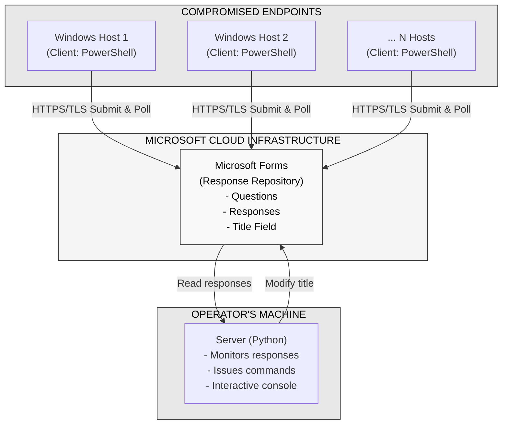
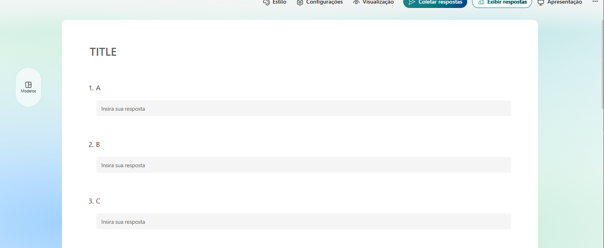
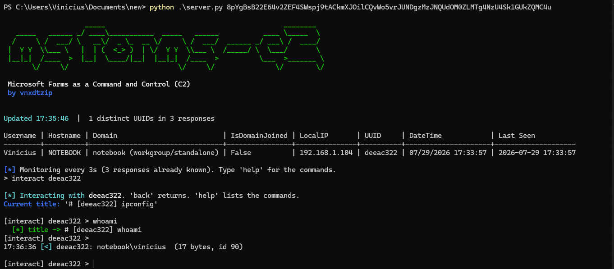
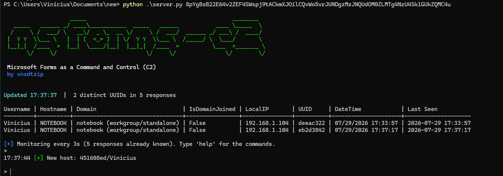
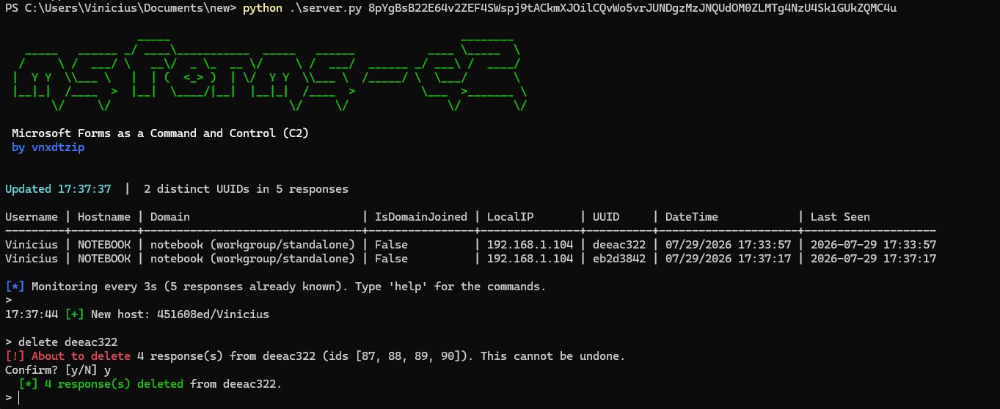

# Ms-Forms C2

## Introduction

This project demonstrates a novel approach to building a Command and Control (C2) infrastructure by leveraging Microsoft Forms as the primary communication medium. Unlike traditional C2 frameworks that require dedicated servers, complex infrastructure, and custom protocols, this solution uses a ubiquitous and legitimate Microsoft cloud service to establish bidirectional communication with compromised endpoints.

---

## Setup

### Creating the Microsoft Form

Before running the C2 framework, you must create a Microsoft Form with the exact specifications below. This form will serve as your centralized communication hub.

#### Form Configuration Requirements

1. **Access Level**
   - The form must be PUBLIC (anyone with the link can access)
   - This allows both the client and server to submit and retrieve data without authentication complications

2. **Form Title**
   - The form must have exactly ONE title field
   - This title is used for issuing commands from the operator to clients
   - Format: `[UUID] COMMAND` (e.g., `[3f9a1c2b] whoami`)

3. **Questions (Fields)**
   - The form must have exactly NINE (9) questions
   - ALL questions must be of type "Text" (single-line text input)

---

## Workflow Examples

### Example 1: Initial Connection and Host Detection

### Example 2: Command Execution and Response Collection

### Example 3: Multi-Host Management

---

## License & Disclaimer

This project is provided for **authorized security testing and educational purposes only**. Unauthorized access to computer systems is illegal. Users are responsible for ensuring all use is legal and authorized.

- Do not use on systems you don't own or have explicit permission to test
- Do not use for malicious purposes
- Follow all applicable laws and regulations
- Report security findings responsibly to affected organizations

Author & Research: @xpsecsecurity